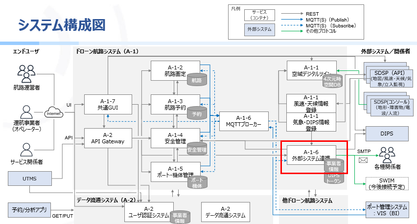

# ドローン航路システム 外部システム連携ライブラリ(Java版)

## 概要
- 外部システムへの情報取得や情報提供する機能群です。
- DIPS 2.0へのトークン発行や飛行禁止エリア情報取得、航路情報や予約情報のメール配信をすることができます。

## ドローン航路システムにおける本機能の位置づけ

## 環境構築手順
- 環境構築手順については、以下のリンクを参照してください。

<a href="drone-external-integration/docs/A-1-6外部システム連携コンテナ構築手順.md" target="_blank">external/drone-external-integration/docs/A-1-6外部システム連携コンテナ構築手順.md</a>

## 注意事項
* DIPS 2.0と連携するには、事前にDIPS2.0へのクライアントID発行手続き、及びDIPSアカウントの作成が必要となります。

## ライセンス
- 本リポジトリはMITライセンスで提供されています。
- ソースコードおよび関連ドキュメントの著作権は株式会社NTTデータに帰属します。
