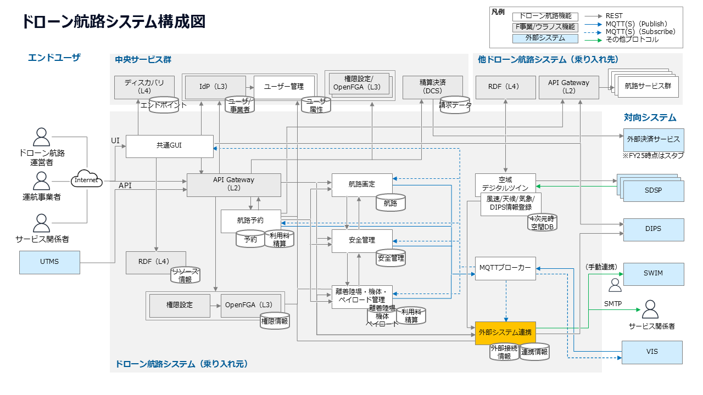

# ドローン航路システム 外部システム連携ライブラリ(Java版)

## 概要
- 外部システムへの情報取得や情報提供する機能群です。
- DIPS 2.0へのトークン発行や飛行禁止エリア情報及び飛行計画情報の取得、予約情報のメール配信、SWIM連携用Excelダウンロードをすることができます。

## ドローン航路システムにおける本機能の位置づけ

## 環境構築手順
- 環境構築手順については、以下のリンクを参照してください。

<a href="drone-external-integration/docs/外部システム連携コンテナ構築手順.md" target="_blank">external/drone-external-integration/docs/外部システム連携コンテナ構築手順.md</a>

## 注意事項
* DIPS 2.0と連携するには、事前にDIPS2.0へのクライアントID発行手続き、及びDIPSアカウントの作成が必要となります。

## ライセンス
- 本リポジトリはMITライセンスで提供されています。
- ソースコードおよび関連ドキュメントの著作権はグリッドスカイウェイ有限責任事業組合及び株式会社NTTデータに帰属します。
