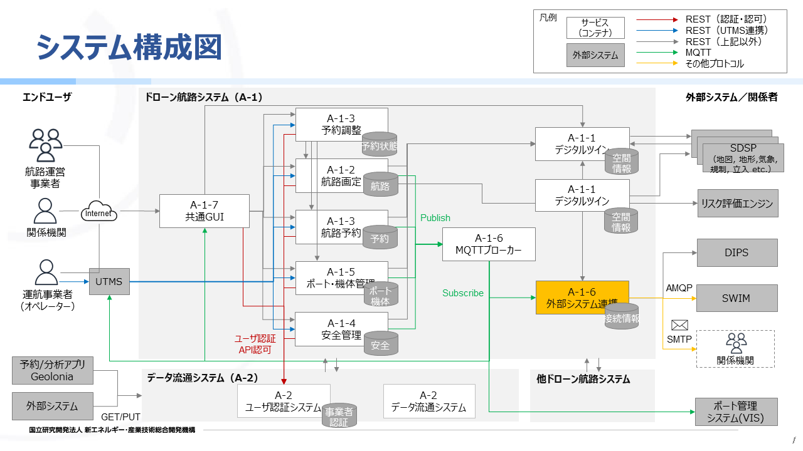
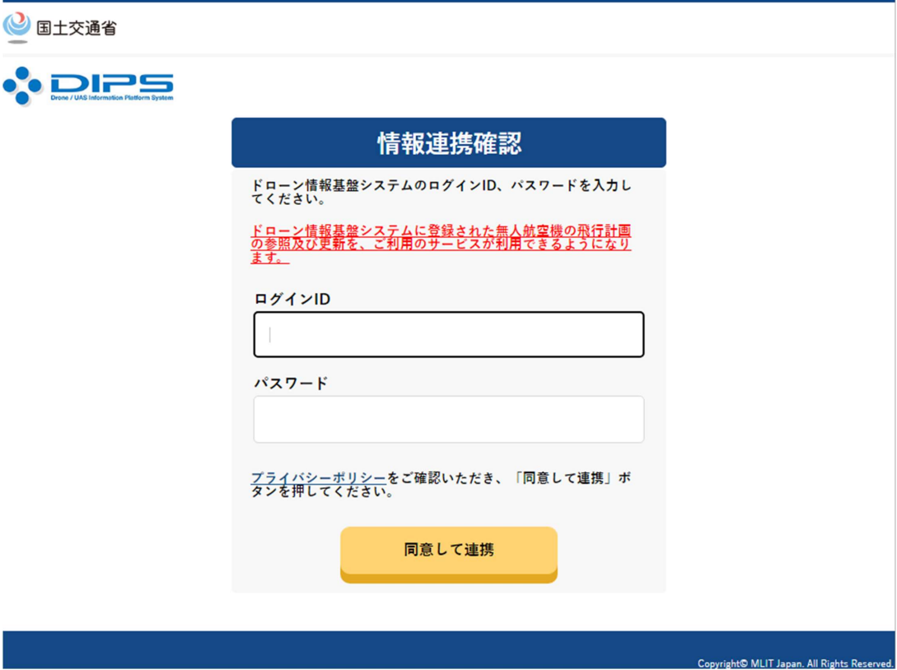

## 概要  
本手順では、A-1-6外部システム連携サービスの動作確認を可能とするDockerコンテナの構築手順を説明する。  



## 手順概要
### 1. 事前準備
本リポジトリを動作させるために必要なDB、メッセージブローカー、SMTPサーバ、DIPS2.0 APIの準備を行う。

### 2. DB構築
DDL、DMLを実行し、データベース環境を構築する。

### 3. Docker構築
本リポジトリ（drone-external-integration）をDockerコンテナとして起動する。

### 4. 動作確認
動作確認を実施する。

## 手順詳細

### 1. 事前準備

#### 1.1 実行環境準備
本リポジトリのコンテナを構築するために必須となるソフトウェアを事前にインストールする。  
必要なソフトウェアおよび、動作確認済み実行環境は以下のとおりである。

| 名称 | バージョン | 備考 |
| --- | --- | --- |
| JDK(Amazon Corretto) | 21 |  |
| Docker | 25.0.5 |  |
| Maven | 3.8.4 |  |

#### 1.2 DB構築準備
DBを構築するために必要なソフトウェアを事前にインストールする。  
本手順で動作確認に使用するソフトウェアは以下のとおりである。

| 名称 | バージョン | 備考 |
| --- | --- | --- |
| PostgresSQL | 16.3-R3 |  |

また、本リポジトリの「variables.env」に以下の環境変数を設定する。  
| 環境変数名 | 説明 | 備考 |
| --- | --- | --- |
| DB_HOSTNAME | データベースのホスト名 |  |
| DB_PORT | データベースのポート番号 |  |
| DB_NAME | データベース名 |  |
| DB_USERNAME | データベースのユーザ名 |  |
| DB_PASSWORD | データベースのパスワード |  |

#### 1.3 DIPS2.0 API利用準備
DIPS2.0 APIを利用するため、事前に利用申請が必要となる。  

DIPS2.0 API利用準備の完了後、本リポジトリの「variables.env」に以下の環境変数を設定する。  
| 環境変数名 | 説明 | 備考 |
| --- | --- | --- |
| DIPS_API_BASE_DOMAIN_URL | DIPS APIのBaseURL（ドメインURL） |  |
| DIPS_API_BASE_PATH | DIPS APIのBaseURL（パス） |  |
| DIPS_TOKEN_BASE_DOMAIN_URL | DIPS 認証エンドポイントのBaseURL（ドメインURL） |  |
| DIPS_TOKEN_BASE_PATH | DIPS 認証エンドポイントのBaseURL（パス） |  |
| DRONE_CLIENT_ID | ドローン航路のDIPS クライアントID<br>DIPS2.0より払いだされたClient IDを設定してください |  |
| DIPS_TOKEN_REFRESH_CLIENT_ID | トークンリフレッシュ時に使用するDIPS クライアントID<br>DIPS2.0より払いだされたClient IDを設定してください |  |
| DIPS_TOKEN_REFRESH_CLIENT_SECRET | トークンリフレッシュ時に使用するDIPS クライアントシークレット<br>DIPS2.0より払いだされたClient Secretを設定してください |  |

#### 1.4 メッセージブローカー準備
A-1-6外部システム連携コンテナ構築手順.mdの手順を実施し、構築を行う。  
また、本リポジトリの「variables.env」に以下の環境変数を設定する。  
| 環境変数名 | 説明 | 備考 |
| --- | --- | --- |
| MQTT_CLIENT | MQTTクライアントID |  |
| MQTT_HOSTNAME | MQTTブローカーのホストURL |  |
| MQTT_PORT | MQTTブローカーのポート番号 |  |
| MQTT_USERNAME | MQTT接続用ユーザ名 |  |
| MQTT_PASSWORD | MQTT接続用パスワード |  |
| MQTT_TRUSTSTORE_PASSWORD | MQTTS接続用トラストストアファイルパスワード |  |
| MQTT_TRUSTSTORE_FILEPATH | MQTTS接続用トラストストアファイルパス | 「`/drn/bin/app/broker.ts`」を設定してください |

#### 1.5 SMTPサーバ準備
メール送信を行うため、SMTPサーバを準備する。  
また、本リポジトリの「variables.env」に以下の環境変数を設定する。  
| 環境変数名 | 説明 | 備考 |
| --- | --- | --- |
| SPRING_MAIL_HOST | SMTPサーバのホスト名 |  |
| SPRING_MAIL_PORT | SMTPサーバのポート番号 |  |
| SPRING_MAIL_USERNAME | SMTPサーバのログインユーザ |  |
| SPRING_MAIL_PASSWORD | SMTPサーバのログインパスワード |  |
  
### 2. DB構築

#### 2.1 DDLの投入
本リポジトリの「drone-external-integration/docs/sql/ddl」ディレクトリ以下のDDLを、DBに投入する。

#### 2.2 マスタDMLの投入
本リポジトリの「drone-external-integration/docs/sql/dml/master」ディレクトリ以下のDMLを、DBに投入する。

### 3. Docker構築  

以下の流れでDockerコンテナの作成、起動を行う。  
- Dockerコンテナ起動時に必要な環境変数ファイル（variables.env）を作成する  
- jarファイルをビルドし、Dockerコンテナイメージを作成する  
- Dockerコンテナイメージを用いてDockerコンテナを作成する（コンテナ作成時に環境変数ファイルをパラメータとして渡し、コンテナ内の環境変数を設定する）  

※本手順では、実行ユーザがdockerグループに所属している前提でコマンドを記載しています。
実行ユーザがdockerグループに所属していない場合、dockerコマンドに「sudo」を付与し、sudoが可能なユーザで実行する必要があります。

#### 3.1 環境変数の設定

#### ①本リポジトリの「variables.env」に、「1.2 DB構築準備」「1.3 DIPS2.0 API利用準備」「1.4 メッセージブローカー準備」「1.5 SMTPサーバ準備」で準備した環境変数が漏れなく設定されていることを確認する。  

#### ②試験環境に合わせて以下の環境変数を設定する。
| 環境変数名 | 説明 | 備考 |
| --- | --- | --- |
| APPENV | 環境差分のあるプロパティファイルの読み込み設定。<br>「`prod`」を設定する。 |  |
| DIPS_FLIGHT_PROHIBITED_AREA_URL | DIPSの飛行禁止エリア取得APIの向き先 | 接続先に応じて、以下を設定してください<br>・本番環境のURL<br>`「https://www.uafpi.dips.mlit.go.jp/api/flight-prohibited-area/search」`<br>・検証環境のURL<br>「`https://www.stg.uafpi.dips.mlit.go.jp/api/flight-prohibited-area/search`」  |
| AIRWAY_API_BASE_DOMAIN_URL | 航路情報取得APIの呼び出しに使用するドメイン |  |
| AIRWAY_API_PATH | A-1-2航路画定機能の航路情報取得APIのパス | 「`/airwayDesign/airway`」を設定してください |
| MAIL_FROM_ADDRESS | メール送信元アドレス：関係者周知にてメール送信する際の送信元アドレス |  |
| MAIL_FROM_NAME | メール送信元名：関係者周知にてメール送信する際の送信者名 |  |
| MAIL_LOGIN_LINK | メール内容_ログインURL：関係者周知にて送信されたメール内にあるドローン航路システムのログインURL |  |
| MAIL_CONTACT_PERSON | メール内容_問い合わせ担当者：関係者周知にて送信されたメール内にある問い合わせの担当者名 |  |
| MAIL_CONTACT_AFFILIATION | メール内容_問い合わせ所属：関係者周知にて送信されたメール内にある問い合わせの所属 |  |
| MAIL_CONTACT_PHONENUMBER | メール内容_問い合わせ電話番号：関係者周知にて送信されたメール内にある問い合わせの電話番号 |  |
| MAIL_CONTACT_MAILADDRESS | メール内容_問い合わせメールアドレス：関係者周知にて送信されたメール内にある問い合わせのメールアドレス |  |

#### 3.2 Dockerコンテナイメージ作成

#### ①ビルド用資材の配置
ビルドに必要なリポジトリ資材を配置する。  
本手順では、ホームディレクトリ配下に以下のパスで資材を配置している想定で手順を作成している。  
- 共通部品リポジトリ（drone-com）の格納先  
```bash
~/work/drone-com
```
- 本リポジトリ（drone-external-integration）の格納先  
```bash
~/work/drone-external-integration
```
  
#### ②drone-comのビルド
```bash
cd ~/work/drone-com
mvn clean install -Dmaven.test.skip
```

#### ③drone-external-integrationのビルド
```bash
cd ~/work/drone-external-integration
mvn clean package -Dmaven.test.skip
```

#### ④Dorkerイメージ作成用資材の配置
- ビルドした資材を配置  
```bash
cd ~/work/drone-external-integration
mkdir -p bin
cp -a drone-external-integration-main/target/*.jar bin/
cp docker-entrypoint.sh ./bin/
```
- トラストストアの配置  
「ActiveMQ-MQTTSコンテナ構築手順」で作成した「broker.ts」を配置する。
```bash
cp {作成したトラストストアファイルのパス}/broker.ts ./bin/
```

#### ⑤Dockerイメージの作成
```bash
docker build -t drone-external-integration-image .
```

#### ⑥Dockerイメージの確認
```bash
docker images
```

#### 3.3 Dockerコンテナ作成

#### ①Dockerコンテナ作成
```bash
docker run -d -p 8283:8283 --name "drone-external-integration" --env-file variables.env drone-external-integration-image:latest /bin/bash
```

#### ②Dockerコンテナの起動確認
```bash
docker ps -a  
```
以下のように、STATUSが「Up」となっていることを確認する。
```bash
CONTAINER ID   IMAGE                                   COMMAND                  CREATED         STATUS         PORTS     NAMES
d88ba81cdabd   drone-external-integration-image:v1.0   "./docker-entrypoint…"   8 minutes ago   Up 8 minutes             drone-external-integration
```

### 4. 動作確認

#### 4.1 DIPS連携 動作確認

#### ①DIPSトークン検証APIの実行
A-1-6外部システム連携で提供しているDIPSトークン検証APIをcurlにて実行し、A-1-6外部システム連携のDBにDIPSのアクセストークンが保存されていないことを確認する。

1. 以下のcurlを実行し、エラーレスポンス（HTTPレスポンスステータスコード：400　message：TokenInfo Not Found）が返却されることを確認する。

```bash
curl -v http://{A-1-6外部システム連携のドメイン}/external/api/v1/dipsTokenVerification -X POST
```
#### ②認証リクエストの実行

DIPS2.0で提供しているAuthorization エンドポイント（ユーザの認可を得るためのエンドポイント）へリクエストを発行することで、ユーザの認証を行う。  
状態・認可状態を判定し、適切なページへリダイレクトさせ、認可コードが取得できることを確認する。

1. 任意のブラウザより、適切なクエリパラメータを設定したうえで以下のURLにアクセスを行う。

- URL：<https://www.dips-reg.mlit.go.jp/auth/realms/drs-fpl/protocol/openid-connect/auth?response_type=code&client_id={DIPS2.0より払いだされたClient%20ID}&scope=openid%20offline_access&state=77fFs23rt02&redirect_uri={予め定義しているログイン成功後のリダイレクトURL}>  
※「state」に設定する値は、CSRFチェックに利用するための値です。動作確認のためのサンプル値となっています。

2. ログイン画面にて「ログインID」と「パスワード」を入力を行う。
- ログインID、パスワードについてはDIPS2.0への申請により事前払い出しされる 

<!--  -->


3. ログイン成功後、リダイレクト先のページにて、ブラウザのアドレスバーに表示されるURLをテキストエディタにコピーする。  
※URLに設定されているリクエストパラメータ「code」を後の手順にて使用します。

#### ③アクセストークン取得リクエストAPIの実行
DIPS2.0で提供しているアクセストークン取得リクエストAPIをcurlにて実行し、DIPSのアクセストークンとリフレッシュトークン（アクセストークン更新用）が取得できることを確認する。

1. 以下のcurlを実行し、正常にレスポンスが返ってくることを確認する。

```bash
curl -X POST https://www.dips-reg.mlit.go.jp/auth/realms/drs-fpl/protocol/openid-connect/token \
  -H "Content-Type: application/x-www-form-urlencoded;charset=UTF-8" \
  -d "grant_type=authorization_code&code={手順②にて取得したパラメータ：code}&redirect_uri={予め定義しているログイン成功後のリダイレクトURL}&client_id={DIPS2.0より払いだされたClient ID}&client_secret={DIPS2.0より払いだされたClient Secret}"
```

#### ④DIPSトークン保存APIの実行

A-1-6外部システム連携で提供しているDIPSトークン保存APIをcurlにて実行し、リクエストボディの値が「dips_access_tokens」テーブルへ保存されることを確認する。

1. 以下のcurlを実行し、正常にトークン情報が保存されることを確認する。

```bash
curl -v http://{A-1-6外部システム連携のドメイン}/external/api/v1/dipsToken -X PUT -H "Content-Type: application/json" -d '{"clientId": "{DIPS2.0より払いだされたClient ID}", "accessToken": "{アクセストークン取得リクエストにてレスポンスされるパラメータ：access_token}", "expiresIn": 300, "refreshExpiresIn": 3600, "refreshToken": "{アクセストークン取得リクエストにてレスポンスされるパラメータ：refresh_token}", "tokenType": "bearer", "idToken": "{アクセストークン取得リクエストにてレスポンスされるパラメータ：id_token}", "notBeforePolicy": 0, "sessionState": "{アクセストークン取得リクエストにてレスポンスされるパラメータ：session_state}", "scope": "openid profile offline_access"}'
```

#### ⑤DIPS飛行禁止エリア情報取得APIの実行
A-1-6外部システム連携で提供しているDIPS飛行禁止エリア情報取得APIをcurlにて実行し、DIPSから情報を取得できることを確認する。

1. 以下のcurlを実行し、正常に取得結果が返却されることを確認する。

``` bash
curl -v http://{A-1-6外部システム連携のドメイン}/external/api/v1/flightProhibitedAreaReceiver -X POST -H "Content-Type: application/json" -d '{ "features": { "coordinates": [ [ 139.42, 35.68 ], [ 139.48, 35.68 ], [ 139.48, 35.6 ], [ 139.42, 35.6 ] ] }, "startTime": "20001218 1200", "finishTime": "20241228 2359"}'
```
　

※検索条件である緯度・経度や有効期間開始日時・有効期間終了日時のパラメータ値は任意に設定してください。

#### 4.2 MQTTS通信（メッセージブローカーとの連携）動作確認

航路情報をpublishすることにより、A-1-6外部システム連携で提供している航路情報受信機能にて受信した航路情報がDBへ格納されていることを確認する。

#### ①メッセージのPublish

以下の情報メッセージをA-1-6のMQTTブローカーへPublishする。  
**※ActiveMQ等、Publishが可能なMQTTクライアントを利用してください。**

- トピック  
airway/administrator/airwayInformation/airwayIdSample
- メッセージ  
本リポジトリの「drone-external-integration/docs/sample/航路登録-JSON.txt」を参照

#### ②DBの確認

「AIRWAY」テーブルにレコードが登録されていることを確認する。

#### 4.3 メール送信（SMTPサーバとの連携）動作確認

前提：
- 航路情報がDBに登録されていること（「4.2 MQTTS通信（メッセージブローカーとの連携）動作確認」にて登録済み）
- 確認用の周知先情報を持った事業者がDBに登録されていること（「2.2 マスタDMLの投入」にて登録済み）

#### ①航路関係者登録APIの実行
**※本手順を実施すると、「NOTIFICATION_TARGET_INFO」テーブルに登録されているメールアドレスにメールが送信されます。動作確認の際は、送信しても問題ないかご確認ください。**  
  
以下のcurlを実行し、正常に登録処理が完了されることを確認する。  
リクエスト情報の航路ID（airwayId）、事業者ID（relatedPartiesIdList）は前提にて登録した情報を設定する。
```
curl -v http://{A-1-6外部システム連携のドメイン}/external/api/v1/airwayTenantLink -X POST -H "Content-Type: application/json" -d '{ "airwayId" : "70782784-568c-62dfd-fb3e90051c00-U96", "relatedPartiesIdList" : ["53e6b8c7-1cec-ad87-1ca9-70349aa0b1bc"]}'
```

#### ②メールの確認
①実行後、自動でメール送信処理が動作するため、周知情報のメールが受信できていることを確認する。