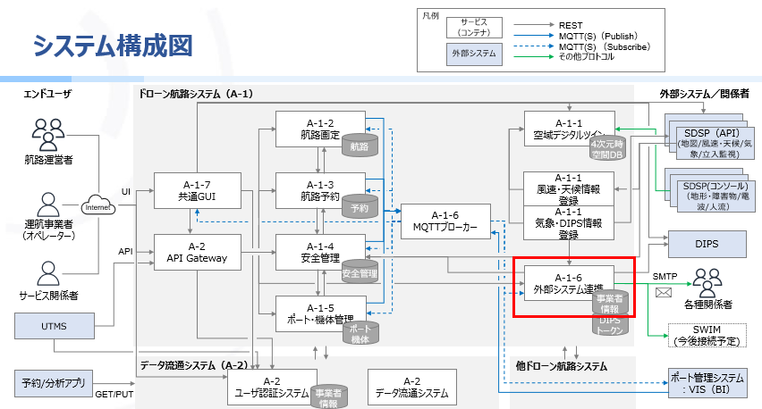

# ドローン航路システム 外部システム連携：SWIMデータ変換サンプル
## 概要
- ドローン航路情報をSWIMデータ(AIXM)へ変換するアプリケーションの実装例を、OSSとして公開したものである。

## ドローン航路システムにおける本機能の位置づけ

## アプリケーション構成
- pom.xml
- src
  - main
    - java
      - jp.go.meti.drone.backend.api.sample
        - SampleMainApplication.java
      - jp.go.meti.drone.batch.swim.entity.inner
        - GeometryInfo.java
      - jp.go.meti.drone.batch.swim.service.aixm
        - AixmUtil.java
        - airspace
          - AirSpaceConverter.java

## アプリケーション実行環境

| ツール    | バージョン |
| --------  | ---------  |
| openjdk   |  21.0.4    |
| STS       |  4     |

## ライセンス

- 本リポジトリはMITライセンスで提供されています。
- ソースコードおよび関連ドキュメントの著作権は株式会社NTTデータに帰属します。
